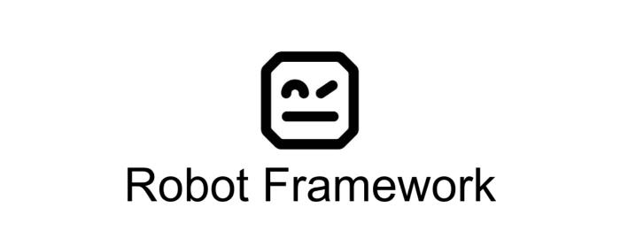

# Test com robot-framework com python para android

## 🚀 Tecnologias ( Em desenvolvimento)

- [] - plataforma de desenvolvimento
- [Robot Framework] - framework de testes automatizados da Microsoft. Versão: 12.9.0
- [Python] - linguagem de programação

## 👨🏻‍💻 Como executar o projeto (Em desenvolvimento)

Execute os comandos abaixo para instalar as dependências do projeto e execução dos testes:


Para executar os testes: ( Em desenvolvimento)
```
robot -d ./logs NOME_TESTE.robot ou robot -d ./logs  para executar todos.
```


